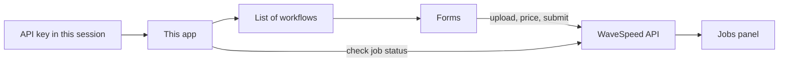

<p align="center">
  <a href="https://my-wavespeed-proj.netlify.app/"></a>
  <a href="https://my-wavespeed-proj.netlify.app/"></a>
  
  
  
  
</p>

<h1 align="center">WaveSpeedAI API Tool</h1>

<p align="center">
  A browser UI for <a href="https://wavespeed.ai">WaveSpeed</a>'s generation API. 49 workflows, live pricing, and job tracking. No backend of its own.
</p>

<p align="center">
  <a href="https://my-wavespeed-proj.netlify.app/"><strong>Open the live app</strong></a>
  · use your own WaveSpeed API key
</p>

This is an unofficial client. It is not affiliated with WaveSpeed.

You paste a WaveSpeed key, pick a workflow, and run a generation. Cost is estimated before you confirm. Jobs show up in a history panel. Billing stays on your WaveSpeed account. This site never sits in the middle of those requests.

## What it does

- **49 WaveSpeed workflows** across Seedance 2.5 / 2.0 / Fast / Mini, MiniMax Hailuo 3, GPT Image 2, Nano Banana Pro & 2, Seedream v5 Pro, Seedream v5 Lite, SeedVR2, and Scail 2
- Text-to-video, image-to-video, reference-to-video, video edit / extend / upscale, motion transfer, text-to-image, and image edit
- Live cost on the submit button, then a confirm step that checks your wallet
- Upload images, video, or audio, or paste URLs
- Job history for 7 days, with output preview and (if you turn it on) reload of a previous run's settings
- API key stays in memory for the session. Optional drafts stay on this device and expire after 7 days.

## How it fits together

There is no app server. After you paste a key, the page talks to WaveSpeed's API directly.



Workflows are registered in one place. Each entry has a model id, a label, and a form. A lot of Seedance variants share a form and only differ in what options they expose (duration, resolution, last frame, and so on), so a new close variant is usually another registry row rather than a new page.

Other pieces you will notice in the UI:

- **Cost:** the button shows an estimate. Confirming rechecks price and balance. If the wallet is short, you get a top-up link.
- **Jobs:** the panel polls until a run finishes, keeps recent jobs for 7 days, and can filter to the current workflow.
- **Key and drafts:** the key is not saved in the browser. Saving form drafts is optional, local, and easy to wipe.

WaveSpeed's website playground keeps a content safety checker locked on. Their API says that control is available to API clients, and that is what this app uses. Filters from the model providers (ByteDance, OpenAI, Google, and others) still apply. Anything you generate is tied to your WaveSpeed account.

## Supported workflows

| Family | Workflows |
| --- | --- |
| **Seedance 2.5** | Image-to-video, turbo · text-to-video, turbo · video edit, turbo · video extend |
| **Seedance 2.0 / Fast / Mini** | The same task set per family, with different duration and resolution limits |
| **MiniMax Hailuo 3** | Text-to-video · image-to-video · reference-to-video |
| **GPT Image 2** | Text-to-image · edit |
| **Nano Banana Pro** | Text-to-image · edit · edit ultra · edit multi |
| **Nano Banana 2** | Text-to-image · fast · edit · edit fast |
| **Seedream v5 Pro** | Image edit |
| **Seedream v5 Lite** | Sequential image edit |
| **SeedVR2** | Video upscale (up to 4K) |
| **Scail 2** | Image + driving video to motion transfer |

## Privacy and hosting

- Hosted on [Netlify](https://my-wavespeed-proj.netlify.app/). Search engines are asked not to index it.
- The visit count in the badge is [GoatCounter](https://www.goatcounter.com/) traffic for the live app, not GitHub README views.

## Run locally

You need a WaveSpeed API key from [wavespeed.ai](https://wavespeed.ai). WaveSpeed bills usage, not this project.

```bash
npm install
npm run dev
```

| Script | What it does |
| --- | --- |
| `npm run dev` | Dev server |
| `npm run build` | Typecheck, then production bundle |
| `npm run preview` | Serve the production build |

## Stack

React 19, TypeScript, Vite 8, Tailwind CSS 4, Netlify.
